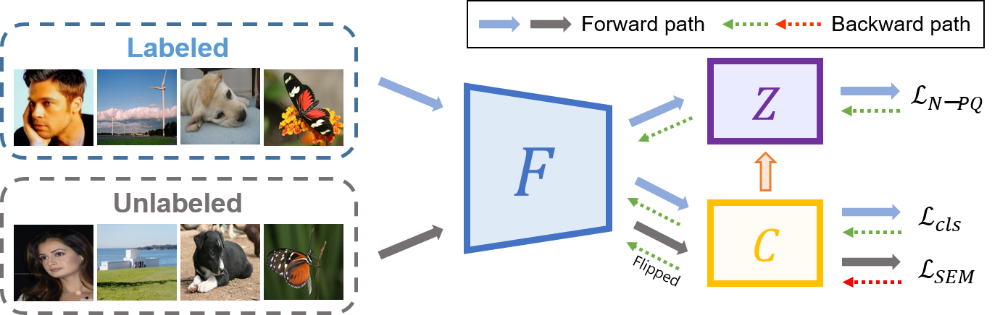
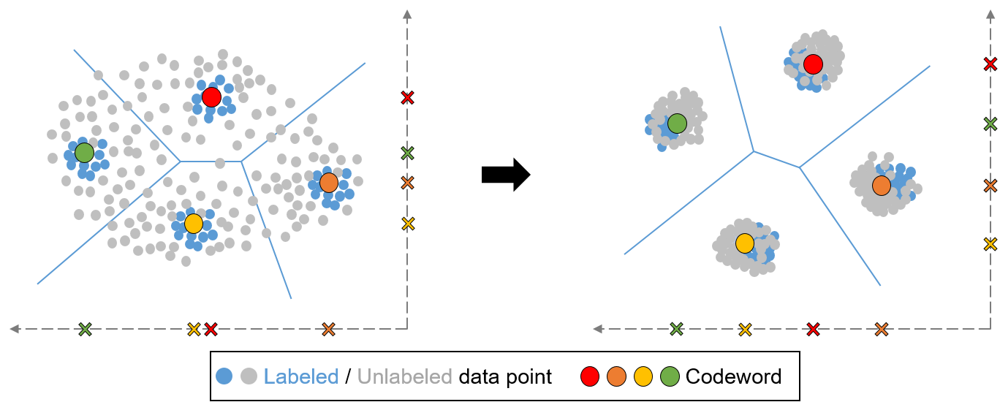
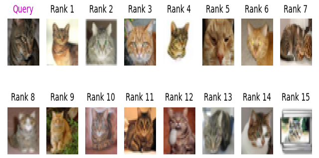
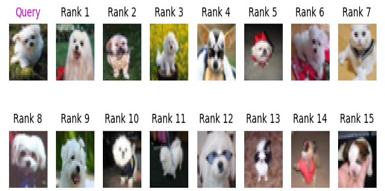
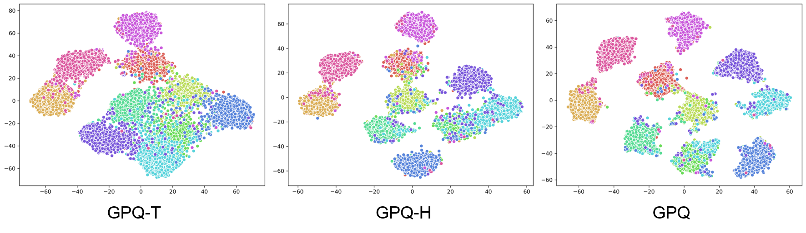

## Generalized Product Quantization Network for Semi-supervised Image Retrieval
Tensorflow implementation of GPQ    
Accepted to CVPR 2020 - <a href="https://openaccess.thecvf.com/content_CVPR_2020/papers/Jang_Generalized_Product_Quantization_Network_for_Semi-Supervised_Image_Retrieval_CVPR_2020_paper.pdf">paper</a>  
Young Kyun Jang and Nam Ik Cho  

## Abstract

Image retrieval methods that employ hashing or vector quantization have achieved great success by taking advantage of deep learning. However, these approaches do not meet expectations unless expensive label information is sufficient. To resolve this issue, we propose the first quantization-based semi-supervised image retrieval scheme: Generalized Product Quantization (GPQ) network. We design a novel metric learning strategy that preserves semantic similarity between labeled data, and employ entropy regularization term to fully exploit inherent potentials of unlabeled data. Our solution increases the generalization capacity of the quantization network, which allows overcoming previous limitations in the retrieval community. Extensive experimental results demonstrate that GPQ yields state-of-the-art performance on large-scale real image benchmark datasets.

## Overall Architecture

<p align="center"></p>

GPQ consitsts of three components: feature extractor *F*, PQ table *Z* and classifier *C*. All the components are trained with the small amount of labeled data with *N-pair Product Quantization loss*, and the large amount of unlabeled data with *Subspace Entropy Mini-max loss*.

## 2D Voronoi Diagram of Our Concept
<p align="center"></p>

While training, codewords move toward unlabeled data points, and at the same time, both labeled and unlabeled data points cluster near the codewords.

## How to use

### 1. Install requirements on your environment.
- Tensorflow=1.14
- Tflearn=0.3.2
- Matplotlib=3.2.1

### 2. Preparation.
- We provide image retrieval model and data for CIFAR-10, and lists of data and label information of NUS-WIDE
- CIFAR-10: Download pretrained <a href="https://drive.google.com/a/snu.ac.kr/file/d/1YDB0aB4NrFbL5ZSaE0PA8GXmiqyQYkHR/view?usp=sharingR">model</a> and <a href="https://drive.google.com/a/snu.ac.kr/file/d/1T2V5JwFcgqyOA4d2gcsSzviYvPiwMCTX/view?usp=sharing">data</a>.
- Extract them to the `/path/to/GPQ-master`.
- Make sure the tree seems as:  
```
|--GPQ-master
   |--cifar10
      |--batches.meta
      |--data_batch_1
      |--data_batch_2
      |--data_batch_3
      |--data_batch_4
      |--data_batch_5
      |--test_batch
      |--cifar10_Similarity.mat
   |--models
      |--48bits_example.ckpt.data-00000-of-00001
      |--48bits_example.ckpt.index
      |--48bits_example.ckpt.meta
      |--ImageNet_pretrained.mat
```
### 3. Test
- From cifar10 dataset, we use 1,000 images for query and 54,000 images to build retrieval database.
- We provide 48bits (12 codebooks with 2^4 codewords) pretrained model as an example.
- Make sure to set proper path in `config.py`.
- Run `Demo.py`, it will print mAP and stores one of the visualized ranked-list.
- Examples
 
 <p align="center"></p>
 
 <p align="center"></p>
 
### 4. Train
- We employ randomly selected 5,000 images with labels and 54,000 images without labels for semi-supervised learning.
- To control the number of bits used for image retrieval, modify `config.py` to change the number of codebooks, codewords.
- Run `train.py`, and it will save the model parameters and checkpoints for every 20 epochs.


## tSNE Visualization

<p align="center"></p>

## Citation
```
@InProceedings{GPQ,
author = {Young Kyun Jang and Nam Ik Cho},
title = {Generalized Product Quantization Network for Semi-supervised Image Retrieval},
booktitle = {IEEE Conference on Computer Vision and Pattern Recognition (CVPR)},
month = {June},
year = {2020}
}
```

## Contacts

Youngkyun Jang: kyun0914@ispl.snu.ac.kr
